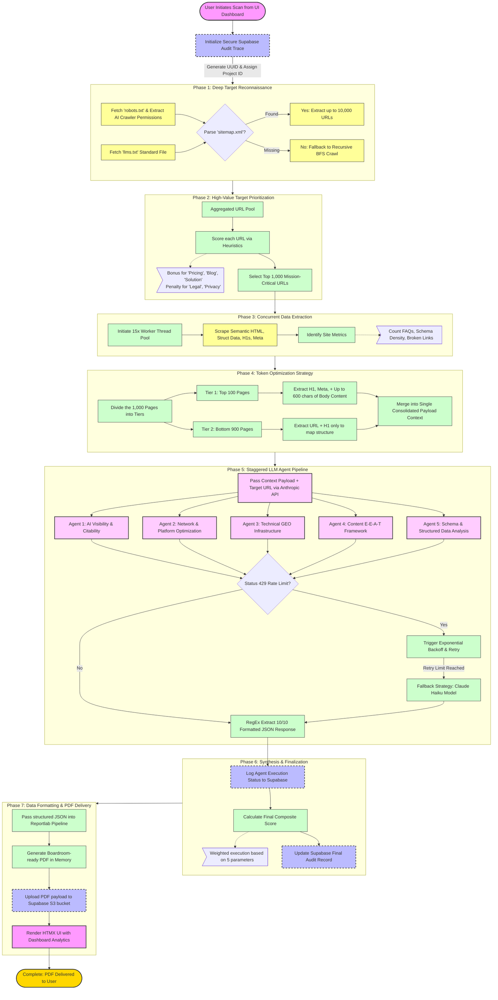

# GEO-SEO Architecture: Manager's Flowchart

Here is the comprehensive, end-to-end flowchart of the entire GEO-SEO architecture. This demonstrates the robust logic scaling from the moment the user clicks "Analyze" to the generation of the boardroom-ready PDF.

### 📋 Breakdown of Key Architectural Highlights
If you need to speak to the specifics of the diagram above, here are 3 key technical highlights:

1. **Strategic URL Scaling (Phase 2 & 4):** The application doesn't blindly feed 10,000 URLs to Claude (which would immediately crash due to `429 Rate Limits` and token explosions). Instead, it uses a **Heuristic Ranker** to find the 1,000 most profitable pages (e.g., pricing, solutions, case-studies), then **compresses** the payload to deep-read the top 100 pages while mapping the sheer structure of the remaining 900.
2. **Concurrent Workers vs. Staggered LLMs:** It utilizes heavy thread pooling (15 concurrent workers) to fetch HTML blisteringly fast. However, when connecting to Claude (Phase 5), it pivots to *staggered, sequential execution* across its 5 agents to guarantee it skirts the strict Tokens-Per-Minute restrictions.
3. **Enterprise Resilience (Phase 5):** The system features a built-in "Exponential Backoff" strategy gracefully woven inside. If the API rate limits the engine, the internal loop pauses, re-attempts, and finally dynamically fails over to a cheaper model (Claude 3.5 Haiku) automatically just to guarantee the audit successfully finishes for the user.
